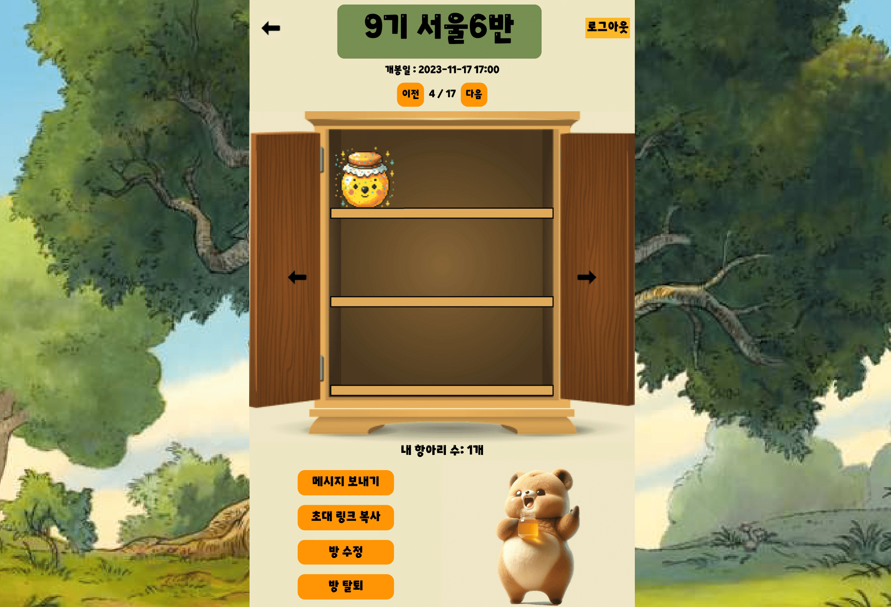
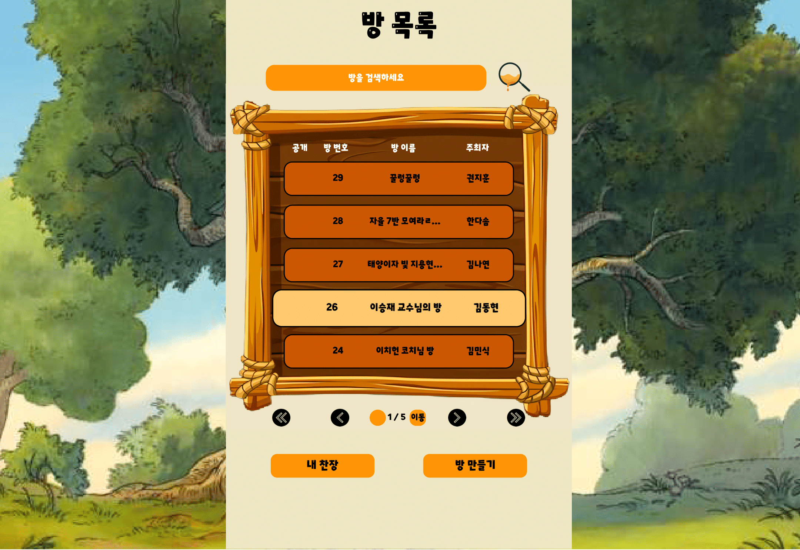
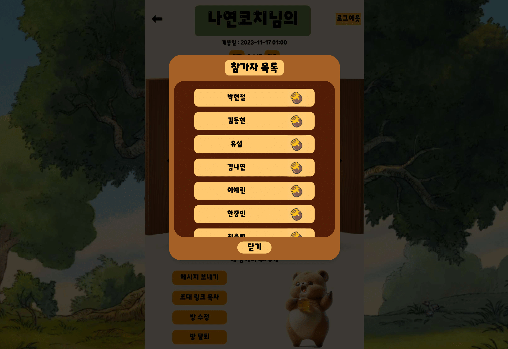

# A701 Thirty(꿀스라이팅)

## Priview


>개봉일을 정하고, 서로에게 편지를 쓰는 **익명롤링페이퍼** 사이트


## 주요 기능

- 방 참여 후 원하는 유저에게 익명 메시지 전송할 수 있어요
- 개봉일이 되면, 받은 메시지(꿀단지)를 읽을 수 있어요

## 세부 기능

| 메인 기능      | 기능명                  | 상세 설명                                                                                                                         |
|:-----------|:---------------------|:------------------------------------------------------------------------------------------------------------------------------|
| 1. 방       | 1-1. 방 생성            | 누구나 메세지 공개일을 설정하고 방을 생성하고 친구들을 생성할 수 있습니다. 이때, 암호를 설정하고 비밀방을 만들 수 있어요.                                                        |
|            | 1-2. 방 삭제            | 방장은 방을 삭제할 수 있어요.                                                                                                             |
|            | 1-3. 방 참여            | 방 목록에서 방에 참여할 수 있어요.( 모든 방의 최대 인원은 100명입니다.)                                                                                  |
|            | 1-4. 방 나가기           | 방장인 경우 가장 먼저 들어온 다른 유저에게 방장이 넘겨지고 나가지게됩니다.                                                                                    |
|            | 1-5. 방 수정            | 방 비밀번호를 수정할 수 있습니다. 공개 일은 수정할 수 없어요.                                                                                          |
|            | 1-6. 방 검색            | 방 제목에 포함된 검색어를 입력하면 검색기능을 제공합니다.                                                                                              |
|            | 1-7. 방 초대            | "초대 링크 복사" 버튼을 누르고 복사된 url을 지인에게 공유하여 초대할 수 있어요.                                                                              |
| 2. 메세지     | 2-1. 메세지 전송          | "메세지 보내기" 버튼을 눌러 방 참여 인원에게 메세지(꿀단지)를 보낼 수 있어요.                                                                                |
|            | 2-2. 메세지 조회          | 나에게 메세지가 오면 찬장에 표시됩니다. 개봉일이 지나면 조회할 수 있어요.                                                                                    |

## 아키텍처

### 인사이트


<hr/>

## 설치

[포팅 메뉴얼](./exec/포팅 매뉴얼.docx) 참조

## 사용 예시

사용 예시는 [꿀스라이팅 시나리오](./exec/RollingHoney_시연_시나리오.pdf)를 참조하세요


## 개발 설정

- OS: Windows 10 Pro
- Language: Java 11
- Code Editor: IntelliJ, Visual Studio Code

## 릴리즈 히스토리

* 1.0.0
* Project Transfer (프로젝트 이관)

## 기여

1. 해당 프로젝트를 Fork 하세요. (https://lab.ssafy.com/ssafy_opensource/9th_insite/-/forks/new)
    * **Project URL**은 개인 Gitlab ID로 설정해주세요!
    * **Project slug**는 변경하지 않습니다.
2.  새로운 브랜치를 생성하세요.
    *   이때 브랜치는 `dev`브랜치에서 분기해주세요.
    *   브랜치 네이밍은 `기수_팀코드_학번`으로 설정합니다.
    *   ```
        git checkout -b dev  
        git pull origin dev  
        git checkout -b 10th_A101_1011111
3.  변경사항을 commit 하세요 (`git commit -am 'Add some fooBar'`)
4.  브랜치에 Push 하세요 (`git push origin 10th_A101_1011111`)
5.  새로운 Merge Request를 요청하세요
    *   Source branch: `개인ID/프로젝트`에서 새로 생성한 브랜치(`10th_A101_1011111`)
    *   Target branch: `ssafy_opensource/프로젝트` 의 `dev` 브랜치
    *   Description에 수정된 파일의 위치와 변경 사항, 의견 등을 작성해 등록합니다.


## 라이선스

Distributed under the SGPL license. See [License](LICENSE) for more information.

## 사용 화면






